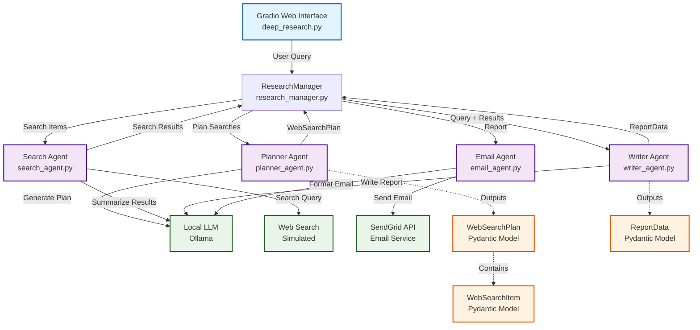

# Deep Research System Architecture

## Mermaid Diagram

## Architecture Overview

The Deep Research system is a multi-agent architecture designed to perform comprehensive research on any given topic. Here's how it works:

### 1. **User Interface Layer**
- **Gradio Web Interface** (`deep_research.py`): Provides a simple web UI for users to input research queries

### 2. **Orchestration Layer**
- **ResearchManager** (`research_manager.py`): Central orchestrator that coordinates the entire research workflow

### 3. **Agent Layer**
- **Planner Agent** (`planner_agent.py`): Creates a strategic search plan with multiple search queries
- **Search Agent** (`search_agent.py`): Executes web searches and summarizes results
- **Writer Agent** (`writer_agent.py`): Synthesizes search results into a comprehensive report
- **Email Agent** (`email_agent.py`): Formats and sends the final report via email

### 4. **External Services**
- **Local LLM** (Ollama by default, via project-root `.env`): Powers all AI agents for planning, searching, writing, and email formatting
- **Web Search** (Simulated): Currently uses mock data for testing
- **SendGrid API**: Handles email delivery

### 5. **Data Models**
- **WebSearchPlan**: Contains the overall search strategy
- **WebSearchItem**: Individual search queries with reasoning
- **ReportData**: Final report with summary and follow-up questions

## Workflow Process

1. **User Input**: User enters a research query via Gradio interface
2. **Planning**: Planner Agent creates 5 strategic search queries
3. **Search Execution**: Search Agent performs parallel searches and summarizes results
4. **Report Generation**: Writer Agent synthesizes findings into a detailed markdown report
5. **Email Delivery**: Email Agent formats and sends the report via SendGrid
6. **Status Updates**: ResearchManager provides real-time progress updates to the user

## Key Features

- **Asynchronous Processing**: Parallel search execution for efficiency
- **Modular Design**: Each agent has a specific responsibility
- **Error Handling**: Graceful handling of failed searches
- **Real-time Updates**: Progress tracking throughout the process
- **Structured Output**: Pydantic models ensure data consistency
